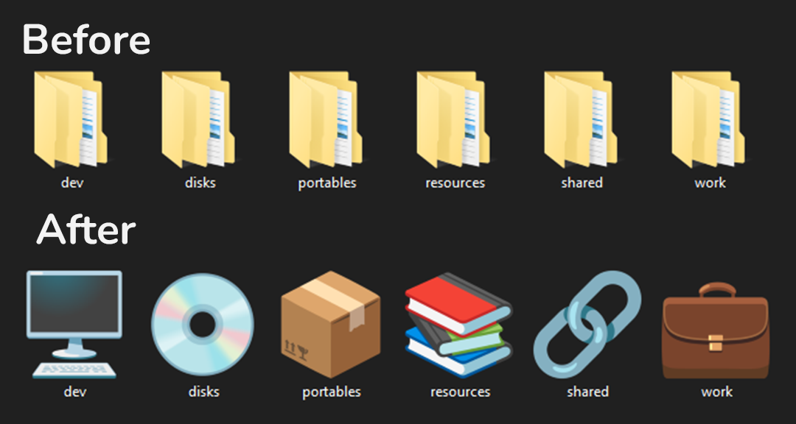

# Folder Iconifier 🎨

Folder Iconifier helps you customize your folder icons with just a couple of drags and presses. You can use emojis, pngs, and icons from the internet for your folders.



- [Folder Iconifier 🎨](#folder-iconifier-)
- [Usage](#usage)
- [Requirements](#requirements)

# Usage

1. Open `main.py`
2. Input the folder path. You can paste it, or drag and drop the folder.

```console
Folder path to be given emoji icon (drag & drop supported)
 >
```

3. Input the icon URL that you want.

```console
Emoji character or an icon URL (.png .ico)
 >
```

These are some examples of valid inputs:

- `https://github.com/googlefonts/noto-emoji/raw/main/png/512/emoji_u1f60a.png`
- `https://upload.wikimedia.org/wikipedia/commons/thumb/0/0c/Blender_logo_no_text.svg/939px-Blender_logo_no_text.svg.png`

# Requirements

- [ImageMagick](https://imagemagick.org/script/download.php)
- Python Modules
  - [requests](https://pypi.org/project/requests/) — `python -m pip install requests`
